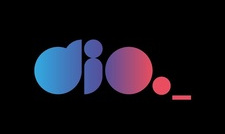
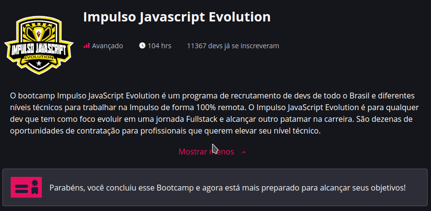
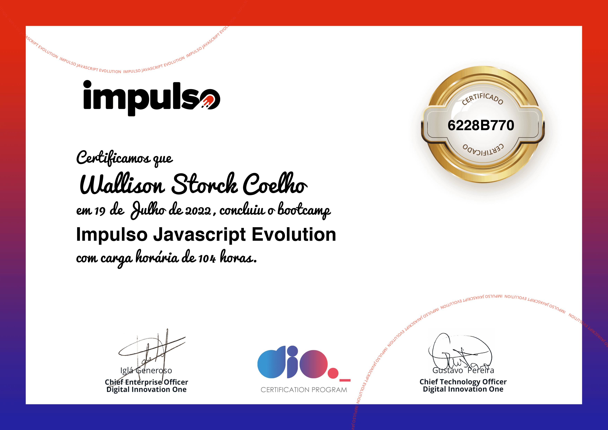

<h1 align="center">
  
</h1>

  <a href="#-projeto">Projeto</a>&nbsp;&nbsp;&nbsp;|&nbsp;&nbsp;&nbsp;
  <a href="#-tecnologias">Tecnologias</a>
 

 

  

 

## 💻 Projeto

O bootcamp Impulso JavaScript Evolution é um programa de recrutamento de desenvolvedores de todo o Brasil e diferentes níveis técnicos para trabalhar na Impulso de forma 100% remota ofetado pela Web Dio, vocÊ pode ver mais informações no link >https://web.dio.me/track/impulso-javascript-evolution

 

## ✨ Tecnologias

Esse projeto foi desenvolvido com as seguintes tecnologias:

- HTML
- CSS
- React
- Node
- Post
- MongoDB
- PostgreSQL

 

## 👔 Certificado

  

---
